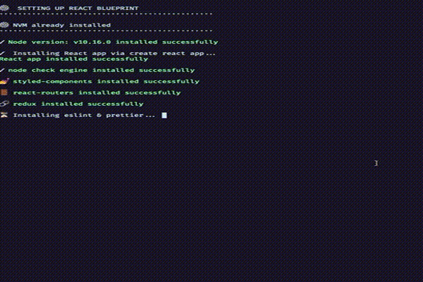

<p align="center">


  <h3 align="center">Create React App Bluechip</h3>
  <p align="center">
  Easy way to setup a full react+ redux application without boilerplates! :tada:.
  </p>
</p>

## TLTR;

[Here the article]() that describe all the libraries used for this script and why they are used. enjoy it :book:.

## Prerequisites

- [wget](https://www.gnu.org/software/wget/) 
- [git](https://git-scm.com/)

## Quickstart
execture in your terminal command below

```
  wget -qO- https://raw.githubusercontent.com/charly-palencia/create-react-app-blueprint/master/install.sh | bash -s [.|folderPath]
```



After installation go into your new folder and run `npm run start`. That's all, your React + Redux project is ready to test!

*Note*: Installing CRA app takes a while, so be patient :smile:.

## Why should I use CRA-blueprint?

## Support me
  <a class="bmc-button" target="_blank" href="https://www.buymeacoffee.com/uIcqUSB" style="line-height: 36px !important;height: 37px !important;text-decoration: none !important;display: inline-flex !important;color: #FFFFFF !important;background-color: #FF813F !important;border-radius: 3px !important;border: 1px solid transparent !important;padding: 0px 9px !important;font-size: 17px !important;letter-spacing: -0.08px !important;box-shadow: 0px 1px 2px rgba(190, 190, 190, 0.5) !important;-webkit-box-shadow: 0px 1px 2px 2px rgba(190, 190, 190, 0.5) !important;margin: 0 auto !important;font-family: 'Lato', sans-serif !important;-webkit-box-sizing: border-box !important;box-sizing: border-box !important;-o-transition: 0.3s all linear !important;-webkit-transition: 0.3s all linear !important;-moz-transition: 0.3s all linear !important;-ms-transition: 0.3s all linear !important;transition: 0.3s all linear !important;"><span style="margin-left:5px">Buy me a coffee</span></a>


## OS verification
- [x] Mac O SMojave
- [x] Ubuntu
- [ ] Window 

