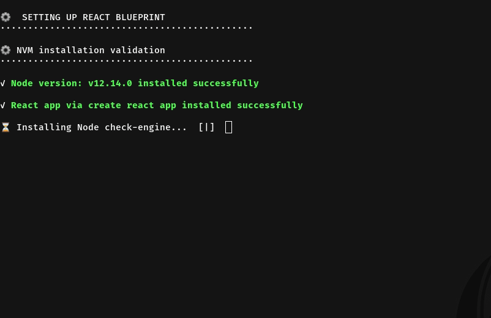

<p align="center">


  <h3 align="center">Create React App(CRA) Bluechip</h3>
  <p align="center">
    Setup React+ Redux application with one line without Boilerplates! :tada:.
  </p>
</p>

## Summary 

If you want to see all the step by step for this project please [go to this article](). Please enjoy it :book:.

## Prerequisites

- [WGET](https://www.gnu.org/software/wget/) 
- [GIT](https://git-scm.com/)
- [NVM](https://github.com/nvm-sh/nvm)

## Quickstart
Run this command in your terminal to create a new project.

```
wget -qO- https://raw.githubusercontent.com/charly-palencia/create-react-app-blueprint/master/install.sh | bash
```

After that, close your current terminal and open a new terminal.

```
crabp --help
```



After installation, go into your app folder and run `npm run start`. That's all, your React + Redux project is ready to test :atom:.

**Note**: Installing *CRA* app takes a while, so be patient :smile:.

## What extra libraries does it included?

| Library name  | Description  |   |
| ------------ | ------------ | ------------ |
| Create React App | Set up a modern web app by running one command.  | [Home Page](https://github.com/facebook/create-react-app)  |
| Redux  | Predictable state container for JavaScript apps  | [Home Page](https://github.com/reduxjs/redux)  |
| Styled-Component  | Visual primitives for the component age. Use the best bits of ES6 and CSS to style your apps without stress.   |  [Home Page](https://github.com/styled-components/styled-components)  |
| Prettier  | Prettier is an opinionated code formatter.  | https://github.com/prettier/prettier  |
| Eslint  | A fully pluggable tool for identifying and reporting on patterns in JavaScript   | [Eslint](https://github.com/eslint/eslint)  |
| React Router  | Declarative routing for React   | [Home Page](https://github.com/ReactTraining/react-router)  |


## What about the built-in setup?

| Setting  | Description  |   |
| ------------ | ------------ | ------------ |
| **.nvm** with node LTS version  | version will be fetch from a third party service in order to get always the last node version  | [More Info](https://github.com/nvm-sh/nvm)  |
|** jsconfig.json** configuration with CRA  |The presence of jsconfig.json file in a directory indicates that the directory is the root of a JavaScript Project.   | [More Info](https://github.com/microsoft/vscode-docs/blob/master/docs/languages/jsconfig.md)  |
| **check-engine **validation before npm i  | A utility to check your engines for Node.js  | [More Info](https://github.com/mohlsen/check-engine)  |

## I don't want this, how can I uninstall it?

Please run the next command, see ya later :(

```
  rm ~/bin/crabp/sh
```

## Why should I use CRA-blueprint?

[TBD]

## Support me
  <a class="bmc-button" target="_blank" href="https://www.buymeacoffee.com/uIcqUSB" style="line-height: 36px !important;height: 37px !important;text-decoration: none !important;display: inline-flex !important;color: #FFFFFF !important;background-color: #FF813F !important;border-radius: 3px !important;border: 1px solid transparent !important;padding: 0px 9px !important;font-size: 17px !important;letter-spacing: -0.08px !important;box-shadow: 0px 1px 2px rgba(190, 190, 190, 0.5) !important;-webkit-box-shadow: 0px 1px 2px 2px rgba(190, 190, 190, 0.5) !important;margin: 0 auto !important;font-family: 'Lato', sans-serif !important;-webkit-box-sizing: border-box !important;box-sizing: border-box !important;-o-transition: 0.3s all linear !important;-webkit-transition: 0.3s all linear !important;-moz-transition: 0.3s all linear !important;-ms-transition: 0.3s all linear !important;transition: 0.3s all linear !important;"><span style="margin-left:5px">Buy me a coffee</span></a>


## OS verification
- [x] Mac O SMojave
- [x] Ubuntu
- [ ] Window


## TODO list
- [ ] Include test suite 
